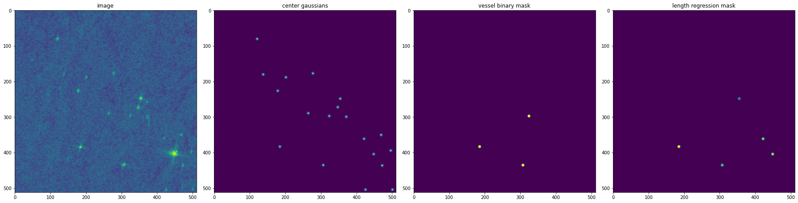

## Xview3, 2nd place solution
https://iuu.xview.us/

### Approach (full solution description, training and testing procedures coming soon)
Ship detection can be transformed to a binary segmentation and regressing problem using UNet like convolutional neural networks with the following outputs:
- centers as gaussians, this solves detection part and the most important part to obtain high detection F1 score
- vessel mask as binary segmentation, round objects with fixed radius
- fishing mask as binary segmentation, round objects with fixed radius
- length mask as regression, round objects with fixed radius

Missing data is ignored in loss functions e.g. nan vessels, nan lengths etc. 

