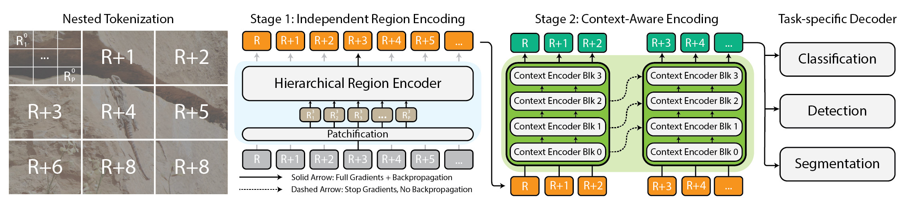

# 🌐 xT: Nested Tokenization for Larger Context in Large Images


> **xT: Nested Tokenization for Larger Context in Large Images**\
> Ritwik Gupta*, Shufan Li*, Tyler Zhu*, Jitendra Malik, Trevor Darrell, Karttikeya Mangalam\
> Paper: https://arxiv.org/abs/something

## About
_xT_ enables you to model large images, end-to-end, on contemporary, memory-limited GPUs. It is a simple framework for vision transformers which effectively aggregates global context with local details.

## Installation
* `conda env create -f environment.yml`

The code has been tested on Linux on NVIDIA A100 GPUs with PyTorch 2+. We use custom CUDA kernels as implemented by the `Mamba` and `OpenAI Triton` projects. Therefore, modifications may be required to use this repository on other operating systems or GPUs.

## Training
Training can be launched through
```./run_submit.sh <num GPUs> <port number> config=<path to config>```

We also provide [SubmitIt](https://github.com/facebookincubator/submitit) scripts in `launch_scripts` to submit training jobs on Slurm clusters.

## Pretrained Models

Weights and configs for our experiments are available on [Hugging Face](https://huggingface.co/bair-climate-initiative/swin-xt/tree/main).

|Name                     | Resolution | Top1-ACC | Params | Mem (GB) | Throughput (region/s) |
|-------------------------|----:|-----:| ---:| ---|---:|
|[Swin-T](https://huggingface.co/bair-climate-initiative/swin-xt/blob/main/swin-t/weights/swin-t-nonxl-256-top1.ckpt) | 256 |  53.76| 31M | 0.30 | 76.43 |
|[Swin-T \<xT> XL](https://huggingface.co/bair-climate-initiative/swin-xt/blob/main/swin-t/weights/swin-t-xl-256-256-top1.ckpt) |  256/256 | 52.93| 47M | 0.31 | 47.81 |
|[Swin-T \<xT> XL](https://huggingface.co/bair-climate-initiative/swin-xt/blob/main/swin-t/weights/swin-t-xl-512-256-top1.ckpt) |  512/256 | 60.56| 47M | 0.29 | 88.28 |
|[Swin-T \<xT> Mamba](https://huggingface.co/bair-climate-initiative/swin-xt/blob/main/swin-t/weights/swin-t-mamba-512-256-top1.ckpt) | 512/256 | **61.97**| 44M | 0.29 | 84.77 |
| |
|[Swin-S](https://huggingface.co/bair-climate-initiative/swin-xt/blob/main/swin-s/weights/swin-s-nonxl-256-top1.ckpt)  | 256 | 58.45| 52M | 0.46 | 44.44 |
|[Swin-S \<xT> XL](https://huggingface.co/bair-climate-initiative/swin-xt/blob/main/swin-s/weights/swin-s-xl-256-256-top1.ckpt) | 256/256 |  57.04| 69M | 0.46 | 39.80 |
|[Swin-S \<xT> XL](https://huggingface.co/bair-climate-initiative/swin-xt/blob/main/swin-s/weights/swin-s-xl-512-256-top1.ckpt) | 512/256 | **63.62**| 69M | 0.46 | 41.45 |
| |
|[Swin-B](https://huggingface.co/bair-climate-initiative/swin-xt/blob/main/swin-b/weights/swin-b-nonxl-256-top1.ckpt)  | 256 | 58.57| 92M | 0.50 | 36.14 |
|[Swin-B \<xT> XL](https://huggingface.co/bair-climate-initiative/swin-xt/blob/main/swin-b/weights/swin-b-xl-256-256-top1.ckpt) |  256/256 | 55.52| 107M | 0.61 | 29.85 |
|[Swin-B \<xT> XL](https://huggingface.co/bair-climate-initiative/swin-xt/blob/main/swin-b/weights/swin-b-xl-512-256-top1.ckpt) | 512/256 | **64.08**| 107M | 0.74 | 24.00 |
|[Swin-B \<xT> Mamba](https://huggingface.co/bair-climate-initiative/swin-xt/blob/main/swin-b/weights/swin-b-mamba-512-256-top1.ckpt) | 512/256 |  63.73| 103M | 0.58 | 29.09 |
| |
|[Swin-L](https://huggingface.co/bair-climate-initiative/swin-xt/blob/main/swin-l/weights/swin-l-nonxl-256-top1.ckpt) | 256 | 68.78| 206M | 0.84 | 17.02 |
|[Swin-L \<xT> XL](https://huggingface.co/bair-climate-initiative/swin-xt/blob/main/swin-l/weights/swin-l-xl-256-256-top1.ckpt) | 256/256 | 67.84| 215M | 1.063 | 16.08 |
|[Swin-L \<xT> XL](https://huggingface.co/bair-climate-initiative/swin-xt/blob/main/swin-l/weights/swin-l-xl-512-256-top1.ckpt) | 512/256 | 72.42| 215M | 1.033 | 16.58 |
|[Swin-L \<xT> Mamba](https://huggingface.co/bair-climate-initiative/swin-xt/blob/main/swin-l/weights/swin-l-mamba-512-256-top1.ckpt) | 512/256 | **73.36**| 212M | 1.032 | 15.61 |

## Citation

```
@article{xTLargeImageModeling,
  title={xT: Nested Tokenization for Larger Context in Large Images},
  author={Gupta, Ritwik and Li, Shufan and Zhu, Tyler and Malik, Jitendra and Darrell, Trevor and Mangalam, Karttikeya},
  journal={arXiv preprint arXiv:tbd},
  year={2024}
}
```