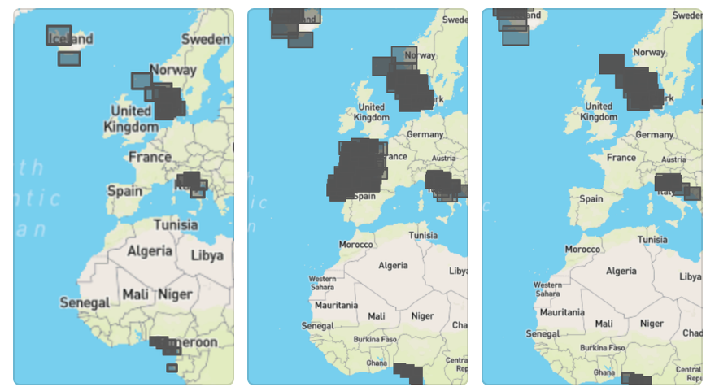

## Xview3, 2nd place solution
https://iuu.xview.us/

| test split  | aggregate score |
|-------------|-----------------|
| public      | 0.593           |
| holdout     | 0.604           | 

### Inference
To reproduce the submission results, first you need to install the required packages. 
The easiest way is to use docker to build an image or pull a prebuilt docker image.

#### Prebuilt docker image

One can pull the image from docker hub and use it for inference
``` docker pull selimsefhub/xview3:mse_v2l_v2l_v3m_nf_b7_r34``` 

Inference specification is the same as for [XView reference solution](https://github.com/DIUx-xView/xview3-reference) 
``` 
docker run --shm-size 16G --gpus=1 --mount type=bind,source=/home/xv3data,target=/on-docker/xv3data selimsefhub/xview3:mse_v2l_v2l_v3m_nf_b7_r34 /on-docker/xv3data/ 0157baf3866b2cf9v /on-docker/xv3data/prediction/prediction.csv
```
#### Build from scratch
```
docker build -t xview3 .
```

### Training

For training I used an instance with 4xRTX A6000. For GPUs with smaller VRAM you will need to reduce crop sizes in configurations.
As I did not make small tiles of large tiff and used memmap instead, fast disks like M.2 (ideally in raid0) should be used.

To reproduce training from scratch: 
1. build docker image as described above
2. run docker image with modified entrypoint, e.g. `docker run --rm --network=host --entrypoint /bin/bash --gpus all --ipc host -v /mnt:/mnt -it xview3:latest`
3. run `./train_all.sh NUM_GPUS DATA_DIR SHORE_DIR VAL_OUT_DIR`, where `DATA_DIR` is the root directory with the dataset, `SHORE_DIR` path to shoreline data for validation set,   `VAL_OUT_DIR` any path where csv prediction will be stored on evaluation phase after each epoch
4. example `./train_all.sh 4 /mnt/md0/datasets/xview3/ /mnt/md0/datasets/xview3/shoreline/validation /mnt/md0/datasets/xview3/oof/`
5. it will overwrite existing weights under `weights` directory in container 

#### Training time

As I used full resolution segmentation it was quite slow, 9-15 hours per model on 4 gpus. 

### Solution approach overview

Maritime object detection can be transformed to a binary segmentation and regressing problem using UNet like convolutional neural networks with the multiple outputs.


### Model architecture and outputs

Generally I used UNet like encoder-decoder model with the following backbones:
- EfficientNet V2 L - best performing
- EfficientNet V2 M
- EfficientNet B7 
- NFNet L0 (variant implemented by Ross Wightman). Works great with small batches due to absence of BatchNorm layers.
- Resnet34

For the decoder I used standard UNet decoder with nearest upsampling without batch norm. SiLU was used as activation for convolutional layers. 
I used full resolution prediction for the masks. 

#### Detection
 
Centers of objects are predicted as gaussians with sigma=2 pixels. Values are scaled between 0-255. 
Quality of dense gaussians is the most important part to obtain high aggregate score.
During the competition I played with different loss functions with varied success:
- Pure MSE loss - had high precision but low recall which was not good enough for the F1 score
- MAE loss did not produce acceptable results
- Thresholded MSE with sum reduction showed best results. Low value predictions did not play any role for the model's quality, so they are ignored. Though loss weight needed to be tuned properly.
 
#### Vessel classification

Vessel masks were prepared as binary round objects with fixed radius (4 pixels)
Missing vessel value was transformed to 255 mask that was ignored in the loss function.
As a loss function I used combination of BCE, Focal and SoftDice losses.

#### Fishing classification
Fishing masks were prepared the same way as vessel masks

#### Length estimation
Length mask - round objects with fixed radius and pixel values were set to length of the object.
Missing length was ignored in the loss function.
As a loss function for length at first I used MSE but then change to the loss function that directly reflected the metric.
I.e.`length_loss = abs(target - predicted_value)/target`

### Training procedure 
#### Data
I tried to use train data split but annotation quality is not good enough and even pretraining on full train set and the finetuning on validation data was not better than simply using only validation data.
In the end I used pure validation data with small holdout sets for evaluation.
In general there was a data leak between val/train/test splits and I tried to use clean non overlapping validation which did not help and did not represent public scores well.  


#### Optimization
Usually AdamW converges faster and provides better metrics for binary segmentation problems but it is prone to unstable training in mixed precision mode (NaNs/Infs in loss values).
That's why as an optimizer I used SGD with the following parameters:
* initial learning rate 0.003
* cosine LR decay
* weight decay 1e-4
* nesterov momentum
* momentum=0.9

For each model there were around 20-30k iterations.
As I used SyncBN and 4 GPUs batch size=2 was good enough and I used larger crops instead of large batch size. 

#### Inference

I used overlap inference with slices of size 3584x3584 and overlap 704 pixels. To reduce memory footprint predictions were transformed to uint8 and float16 data type before prostprocessing. See `inference/run_inference.py` for details.

#### Postprocessing
After center, vessel, fishing, length pixel masks are predicted they need to be transformed to detections in CSV format.
From center gaussians I just used tresholding and found connected components. Each component is considered as a detected object. 
I used centroids of objects to obtain mean values for vessel/fishing/lengths from the respective masks.

#### Data augmentations

I only used random crops and random rotate 180. Ideally SAR orientation should be provided with the data (as in Spacenet 6 challenge) because SAR artifacts depend on Satellite direction. 

### Data acquisition, processing, and manipulation

Input
- 2 SAR channels (VV, VH)
- custom normalization `(Intensity + 40)/15`
- missing pixel values changed to -100 before normalization

Spatial resolution of the supplementary data is very low and doesn't bring any value to the models.

During training and inference I used `tifffile.memmap` and cropped data from memory mapped file in order to avoid tile splitting.


